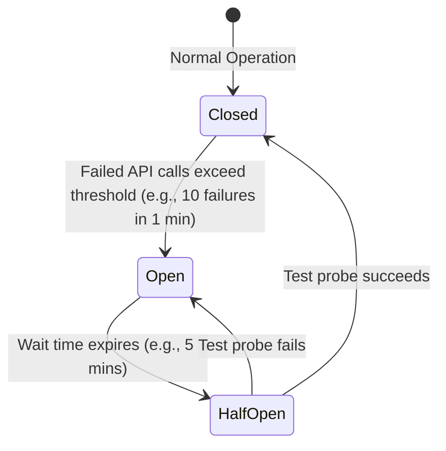

# Nigerian Navy Mentorship Platform: Notifications & Daily Digest System Design

This document details the system design and architecture for a highly performant, resilient, and scalable notification and daily digest email system. 

---

## 1. Architectural Overview

To ensure the system remains responsive even when third-party email providers (e.g., SendGrid, Mailgun) are slow or offline, we use an **event-driven, decoupled architecture**. The main application server never communicates synchronously with external email services; instead, it delegates tasks to an asynchronous message queue.

### High-Level System Architecture Diagram

```mermaid
graph TD
    %% Clients
    UserClients["User Client (Web Browser)"]
    
    %% API and Main App
    subgraph MainApp ["Main Application & Primary Database"]
        API["Next.js API Handler"]
        DB[("Supabase / PostgreSQL")]
        Realtime["Supabase Realtime (WebSockets)"]
    end

    %% Event Broker
    subgraph MessageQueue ["Message & Task Queue (Redis / BullMQ)"]
        InAppQueue["In-App Notification Queue"]
        EmailQueue["Email Dispatch Queue"]
        DigestQueue["Daily Digest Buffer Queue"]
    end

    %% Workers
    subgraph Workers ["Stateless Background Workers"]
        InAppWorker["In-App Notification Worker"]
        EmailWorker["Email Dispatcher (Worker)"]
        DigestWorker["Digest Aggregator & Cron Worker"]
    end

    %% Third-party
    subgraph EmailProviders ["External Email Delivery Services"]
        PrimaryEmail["Primary SMTP/REST API (SendGrid)"]
        SecondaryEmail["Backup SMTP/REST API (AWS SES)"]
    end

    %% Data Flow Steps
    UserClients -->|1. Triggers event (Accept request / Schedule session / Post blog)| API
    API -->|2. Writes transaction| DB
    DB -->|3. PostgreSQL Webhook / PG Trigger| InAppQueue
    DB -->|3. PostgreSQL Webhook / PG Trigger| DigestQueue

    %% Real-Time Flow
    InAppQueue --> InAppWorker
    InAppWorker -->|4. Insert into Notifications Table| DB
    InAppWorker -->|5. Broadcast WebSocket payload| Realtime
    Realtime -->|6. Display toast notification| UserClients

    %% Daily Digest Flow
    DigestQueue --> DigestWorker
    DigestWorker -->|7. Append event payload| DB
    
    %% Email Delivery Flow
    EmailQueue --> EmailWorker
    EmailWorker -->|8. POST email payload| PrimaryEmail
    EmailWorker -.->|9. Fallback on 5xx / Timeout| SecondaryEmail
```

---

## 2. Communication Protocols

| Interface / Connection | Protocol | Rationale |
| :--- | :--- | :--- |
| **Client $\rightarrow$ API Server** | **HTTPS (REST)** | Standard stateless communication for user actions (accepting requests, scheduling sessions, publishing blog posts). |
| **Client $\rightarrow$ Realtime Server** | **WebSockets (WSS) / SSE** | Full-duplex persistent connection for pushing instant in-app alerts (e.g., toast messages) without client polling. |
| **API $\rightarrow$ Message Broker** | **Redis Serialization Protocol (RESP)** | Ultra-low latency enqueueing protocol for offloading tasks to the memory-store queue. |
| **Workers $\rightarrow$ DB** | **PostgreSQL Connection (TCP/IP)** | Standard secure TCP connection using PgBouncer for transaction pool management. |
| **Email Worker $\rightarrow$ Email Provider** | **HTTPS / REST API** | JSON payloads over HTTPS REST APIs are preferred over SMTP as they provide better error reporting, lower connection overhead, and support API keys directly. |
| **Email Provider $\rightarrow$ Web Server** | **HTTPS Webhook** | Used by email providers to asynchronously send delivery telemetry (Delivered, Bounced, Opened, Clicked). |

---

## 3. Database Schema Design (PostgreSQL)

To support real-time user-facing notifications, email outbox buffering, and daily digests, we extend the platform's PostgreSQL schema with the following tables.

### 3.1. Entity Tables

#### `public.notification_preferences`
Allows users to opt in/out of real-time emails, digests, or in-app alerts for different categories.
```sql
CREATE TABLE IF NOT EXISTS public.notification_preferences (
    id BIGINT GENERATED BY DEFAULT AS IDENTITY PRIMARY KEY,
    user_id BIGINT REFERENCES public.profiles(id) ON DELETE CASCADE UNIQUE NOT NULL,
    request_accepted_email BOOLEAN DEFAULT true NOT NULL,
    request_accepted_in_app BOOLEAN DEFAULT true NOT NULL,
    session_scheduled_email BOOLEAN DEFAULT true NOT NULL,
    session_scheduled_in_app BOOLEAN DEFAULT true NOT NULL,
    blog_posted_email BOOLEAN DEFAULT false NOT NULL, -- Defaults false for daily digest opt-in
    blog_posted_in_app BOOLEAN DEFAULT true NOT NULL,
    digest_enabled BOOLEAN DEFAULT true NOT NULL, -- Daily digest opt-in flag
    updated_at TIMESTAMP WITH TIME ZONE DEFAULT timezone('utc'::text, now()) NOT NULL
);
```

#### `public.notifications` (In-App notifications inbox)
Stores historical in-app notifications read by users.
```sql
CREATE TABLE IF NOT EXISTS public.notifications (
    id BIGINT GENERATED BY DEFAULT AS IDENTITY PRIMARY KEY,
    recipient_id BIGINT REFERENCES public.profiles(id) ON DELETE CASCADE NOT NULL,
    actor_id BIGINT REFERENCES public.profiles(id) ON DELETE SET NULL, -- Null for system-generated alerts
    type TEXT NOT NULL CHECK (type IN ('request_accepted', 'session_scheduled', 'blog_published')),
    content JSONB NOT NULL, -- E.g., { "mentor_name": "Capt. John", "session_id": 45, "title": "Career in Logistics" }
    is_read BOOLEAN DEFAULT false NOT NULL,
    created_at TIMESTAMP WITH TIME ZONE DEFAULT timezone('utc'::text, now()) NOT NULL
);
```

#### `public.digest_queue`
Buffers actions that occur throughout the day, which are processed nightly by the Daily Digest worker.
```sql
CREATE TABLE IF NOT EXISTS public.digest_queue (
    id BIGINT GENERATED BY DEFAULT AS IDENTITY PRIMARY KEY,
    user_id BIGINT REFERENCES public.profiles(id) ON DELETE CASCADE NOT NULL,
    event_type TEXT NOT NULL CHECK (event_type IN ('request_accepted', 'session_scheduled', 'blog_published')),
    event_data JSONB NOT NULL, -- Context needed to render this digest item (e.g. titles, times, names)
    processed BOOLEAN DEFAULT false NOT NULL,
    created_at TIMESTAMP WITH TIME ZONE DEFAULT timezone('utc'::text, now()) NOT NULL
);
```

#### `public.email_outbox`
Ensures transactional reliability using the Transactional Outbox pattern. If the worker fails, emails remain in Postgres until successfully retried.
```sql
CREATE TABLE IF NOT EXISTS public.email_outbox (
    id UUID PRIMARY KEY DEFAULT gen_random_uuid(),
    recipient_email TEXT NOT NULL,
    subject TEXT NOT NULL,
    body_html TEXT NOT NULL,
    status TEXT DEFAULT 'pending' CHECK (status IN ('pending', 'processing', 'sent', 'failed', 'dlq')),
    retry_count INTEGER DEFAULT 0 NOT NULL,
    last_attempt_at TIMESTAMP WITH TIME ZONE,
    failed_reason TEXT,
    idempotency_key TEXT UNIQUE NOT NULL, -- Prevents duplicate delivery
    created_at TIMESTAMP WITH TIME ZONE DEFAULT timezone('utc'::text, now()) NOT NULL,
    updated_at TIMESTAMP WITH TIME ZONE DEFAULT timezone('utc'::text, now()) NOT NULL
);
```

### 3.2. Performance Optimization Indexes

To prevent notification processing from locking tables or slowing down search queries:
```sql
-- Fast lookup of unread notifications in the user dashboard
CREATE INDEX idx_notifications_recipient_unread 
ON public.notifications(recipient_id) 
WHERE is_read = false;

-- Fast selection of pending items for a user's daily digest consolidation
CREATE INDEX idx_digest_queue_unprocessed 
ON public.digest_queue(user_id) 
WHERE processed = false;

-- Fast outbox queue polling for worker processing
CREATE INDEX idx_email_outbox_retry 
ON public.email_outbox(status, created_at) 
WHERE status IN ('pending', 'processing', 'failed');
```

---

## 4. Workflows & Execution Paths

### 4.1. Real-Time Notification Workflow (In-App & Email)
When a Mentor schedules a session:
1. **Transaction**: The app inserts a row in `public.sessions`.
2. **Event Trigger**: A PostgreSQL database trigger publishes a payload to the Redis/BullMQ broker under `in_app_notification_queue` and check the user's `notification_preferences`.
3. **In-App Processing**: The `In-App Notification Worker` reads the job, writes the alert to `public.notifications`, and fires a WebSocket payload through Supabase Realtime to push the instant pop-up.
4. **Immediate Email Processing** (If preference is enabled):
   - The worker creates an entry in `public.email_outbox` with an `idempotency_key` (e.g., `sha256(session_id + 'session_scheduled')`).
   - The worker pushes an `email_delivery_job` to the Redis queue.
   - The `Email Dispatch Worker` attempts API delivery.

### 4.2. Daily Digest Workflow
1. **Event Capture**: When events occur, instead of enqueueing immediate emails, the system adds them to `public.digest_queue` for users who have `digest_enabled = true`.
2. **Scheduler (Cron)**: Every night at 00:00 UTC, a scheduler (e.g. AWS EventBridge or pg_cron) pushes a `generate_digests` job to `daily_digest_queue`.
3. **Consolidation**:
   - The `Digest Aggregator Worker` reads the task.
   - It fetches unprocessed records from `public.digest_queue` grouped by `user_id`.
   - For each user, it aggregates the events into a single payload, applies an HTML email template, writes a record to `public.email_outbox`, and marks queue entries as `processed = true`.
   - It enqueues email delivery jobs in the `Email Dispatch Queue`.

---

## 5. Scaling, Failover & Resilience Strategies

### 5.1. Handling Provider Downtime (Outbox & Retry Pattern)
If the external email API returns a `5xx` error or times out:
* **Decoupled Worker Handling**: The thread on the main Next.js client is unaffected.
* **Exponential Backoff with Jitter**: The worker retries the email job using a backoff formula: 
  $$\text{Delay} = 2^{\text{attempt}} \times 100 \text{ seconds} + \text{Random Jitter}$$
* **Dead Letter Queue (DLQ)**: If the retry count exceeds $5$, the row status in `public.email_outbox` shifts to `dlq`. An alert is sent to developers (via Slack/Sentry), preserving the email body without dropping data.

### 5.2. Provider Failover (Circuit Breaker)
We implement a **Circuit Breaker** state machine inside the `Email Dispatch Worker`:

* **Closed State**: Traffic goes to the primary provider (SendGrid).
* **Open State**: Traffic is automatically rerouted to the secondary provider (AWS SES).
* **Alerting**: System administrators receive pager alerts when a failover occurs.

### 5.3. Rate Limiting and Backpressure
External email delivery providers enforce maximum concurrency and monthly quotas.
* **Token Bucket Algorithm**: Workers use Redis-based rate limiters to restrict outbound calls to the provider's max limits (e.g., 100 requests/sec).
* **Scale-Out Consumer Pattern**: Multiple stateless worker containers run in parallel (ECS/Kubernetes). If the queue starts backing up, horizontal auto-scaling (KEDA based on Queue length) spins up more worker instances to ingest jobs without overloading PostgreSQL.

### 5.4. Idempotency (At-Least-Once Delivery Safeguards)
Network issues might cause a worker to successfully dispatch an email but crash before marking the job complete in the queue.
* **Idempotency Key**: The `idempotency_key` constraint in `public.email_outbox` acts as a unique database safeguard. Before calling the provider, the worker checks if the key is already marked `sent` in Postgres. This ensures users never receive duplicate emails for the same trigger event.
