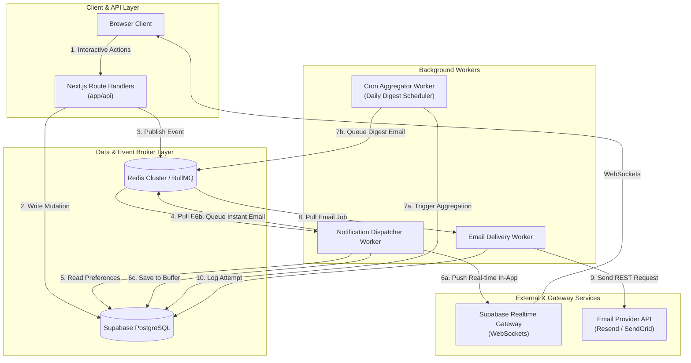
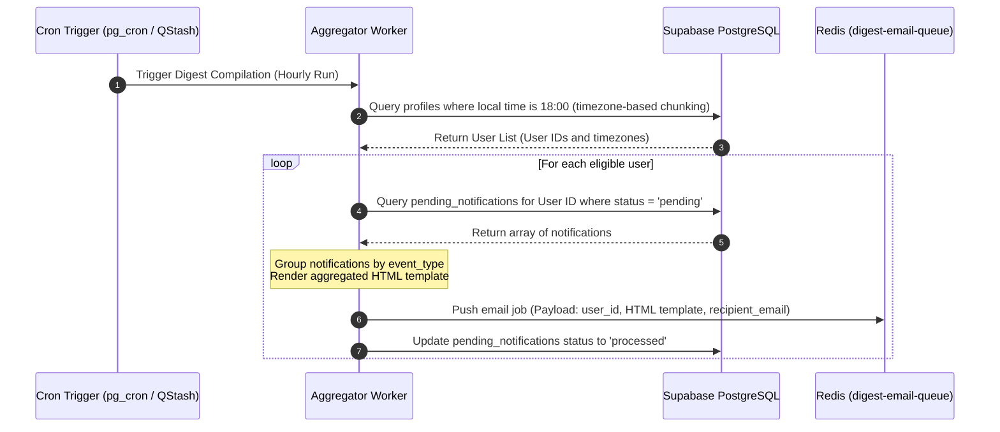

# Real-Time Notification & Daily Digest Email System Design

This document details the production-grade system architecture, communication protocols, database schema, and scaling strategy for dispatching real-time notifications and daily digest emails on the **Nigerian Navy Mentorship Platform**. 

The design is built on top of the platform's Next.js 16 and Supabase (PostgreSQL) stack as defined in [package.json](file:///c:/Users/Ayeba/OneDrive/Dokumente/Nigerian%20Navy%20Mentorship%20Platform/package.json) and [redesign-supabase-migration.md](file:///c:/Users/Ayeba/OneDrive/Dokumente/Nigerian%20Navy%20Mentorship%20Platform/redesign-supabase-migration.md). It is engineered for high performance, reliability, and fault-tolerance—ensuring the application remains fully responsive even when external email delivery services (such as Resend or SendGrid) experience latency or complete outages.

---

## 1. System Architecture

To ensure high responsiveness and decoupling, the notification system uses an **Event-Driven, Producer-Consumer Architecture**. Time-consuming operations (like constructing email HTML, requesting external email delivery APIs, or executing heavy aggregation queries) are handled asynchronously outside the main request-response lifecycle.

### High-Level Architecture Diagram



### Component Details

1. **API / Producer Layer (Next.js 16 Route Handlers)**:
   - When a mentor accepts a request, schedules a session, or publishes a blog post, the Next.js API handler executes the core business logic (updating the DB) and immediately pushes an event payload (e.g., `mentor.request.accepted`, `session.scheduled`, `blog.published`) to the Redis-backed message queue.
   - The user gets an immediate success response (latency `< 50ms`), completely decoupling database updates from notification processing.

2. **Message Broker / Queue Layer (Redis + BullMQ)**:
   - Redis serves as the message broker. **BullMQ** (a robust Redis-based queue for Node.js) manages job states, task orchestration, delayed jobs, and retries.
   - Three distinct queues are maintained:
     - `notification-event-queue`: For raw event processing.
     - `instant-email-queue`: For instant email deliveries.
     - `digest-email-queue`: For aggregated digest emails.

3. **Notification Dispatcher Worker**:
   - A dedicated Node.js background process (running as a Docker container or managed worker) consumes events from the `notification-event-queue`.
   - **Step 1**: It queries the target user's preferences from PostgreSQL.
   - **Step 2**: 
     - **In-App Notification**: Writes a record to `in_app_notifications` and publishes it to the user's active WebSocket channel via Supabase Realtime.
     - **Instant Email**: If the user prefers instant emails, a job is pushed to the `instant-email-queue`.
     - **Daily Digest**: If the user prefers a daily digest, a record is added to the `pending_notifications` table in PostgreSQL to be buffered and aggregated later.

4. **Email Delivery Worker**:
   - Consumes jobs from both `instant-email-queue` and `digest-email-queue`.
   - It compiles the appropriate HTML template (using React Email or another templating engine) and calls the external Email Provider API via HTTP.
   - If the provider is slow or down, the worker retries the job using an exponential backoff with random jitter, preventing message loss.

5. **Daily Digest Scheduler (Cron / Aggregator)**:
   - Runs on a daily schedule (e.g., at 18:00 user local time).
   - Queries `pending_notifications` for unprocessed alerts, groups them by user, aggregates the content (e.g., "You have 1 new mentorship acceptance, 2 scheduled sessions, and 3 new blog posts"), generates a single aggregated email template, drops the email job into `digest-email-queue`, and marks the db records as processed.

---

## 2. Communication Protocols

| Connection Segment | Protocol | Justification |
| :--- | :--- | :--- |
| **Client ↔ API Server** | **HTTPS / HTTP/2 (TLS 1.3)** | Standard secure API request-response pipeline. HTTP/2 multiplexing reduces TCP handshake overhead. |
| **Client ↔ Realtime Gateway** | **WebSockets (WSS)** | Persistent bi-directional channel using Supabase Realtime Channels. Allows immediate push of in-app alerts to the browser without polling. |
| **API Server ↔ Redis Broker** | **TCP / RESP (Redis Serialization Protocol)** | Low-overhead binary protocol utilized natively by Redis and BullMQ for fast operations. |
| **Workers ↔ PostgreSQL DB** | **TCP (PostgreSQL Protocol)** | Standard secure connection utilizing connection pooling (via Supabase Supavisor) to prevent exhaustion of DB connections under load. |
| **Workers ↔ Email Provider** | **HTTPS REST API (TLS 1.3)** | External API communication. Using the provider's HTTP REST endpoints is preferred over SMTP because HTTP has less handshake overhead, supports connection reuse, has cleaner JSON error schemas, and naturally handles request batching. |

---

## 3. Database Schema

The notification system requires schema additions to Supabase (PostgreSQL) to store user preferences, manage the daily digest buffer, track in-app alerts, and maintain delivery logs.

```sql
-- 1. Notification Event Types Enum
CREATE TYPE notification_event_type AS ENUM (
  'request_accepted',
  'session_scheduled',
  'new_blog_article'
);

-- 2. Notification Delivery Channel Enum
CREATE TYPE notification_channel AS ENUM (
  'in_app',
  'email'
);

-- 3. Notification Frequency Enum
CREATE TYPE notification_frequency AS ENUM (
  'instant',
  'digest',
  'none'
);

-- 4. Notification Preferences Table
CREATE TABLE notification_preferences (
  id UUID PRIMARY KEY DEFAULT gen_random_uuid(),
  user_id UUID REFERENCES auth.users(id) ON DELETE CASCADE NOT NULL,
  event_type notification_event_type NOT NULL,
  channel notification_channel NOT NULL,
  frequency notification_frequency NOT NULL DEFAULT 'instant',
  created_at TIMESTAMPTZ NOT NULL DEFAULT NOW(),
  updated_at TIMESTAMPTZ NOT NULL DEFAULT NOW(),
  -- Prevent duplicate configurations per user-event-channel combination
  UNIQUE (user_id, event_type, channel)
);

-- 5. In-App Notifications Table (Real-time dashboard alerts)
CREATE TABLE in_app_notifications (
  id UUID PRIMARY KEY DEFAULT gen_random_uuid(),
  user_id UUID REFERENCES auth.users(id) ON DELETE CASCADE NOT NULL,
  title VARCHAR(255) NOT NULL,
  message TEXT NOT NULL,
  event_type notification_event_type NOT NULL,
  metadata JSONB DEFAULT '{}'::jsonb,
  is_read BOOLEAN NOT NULL DEFAULT FALSE,
  created_at TIMESTAMPTZ NOT NULL DEFAULT NOW()
);

-- 6. Digest Buffer Table (Stores pending notifications for daily digests)
CREATE TABLE pending_notifications (
  id UUID PRIMARY KEY DEFAULT gen_random_uuid(),
  user_id UUID REFERENCES auth.users(id) ON DELETE CASCADE NOT NULL,
  event_type notification_event_type NOT NULL,
  payload JSONB NOT NULL, -- Context needed to render the digest line (e.g. mentor name, session time)
  status VARCHAR(20) NOT NULL DEFAULT 'pending' CHECK (status IN ('pending', 'processed', 'failed')),
  created_at TIMESTAMPTZ NOT NULL DEFAULT NOW(),
  processed_at TIMESTAMPTZ
);

-- 7. Email Delivery Logs Table (For auditing, tracing, and analytics)
CREATE TABLE email_delivery_logs (
  id UUID PRIMARY KEY DEFAULT gen_random_uuid(),
  user_id UUID REFERENCES auth.users(id) ON DELETE CASCADE NOT NULL,
  email_type VARCHAR(50) NOT NULL CHECK (email_type IN ('instant', 'digest')),
  recipient_email VARCHAR(255) NOT NULL,
  subject VARCHAR(255) NOT NULL,
  provider_message_id VARCHAR(255), -- ID returned by Resend / SendGrid
  status VARCHAR(20) NOT NULL DEFAULT 'queued' CHECK (status IN ('queued', 'sent', 'failed', 'retrying')),
  attempts INTEGER NOT NULL DEFAULT 0,
  error_message TEXT,
  created_at TIMESTAMPTZ NOT NULL DEFAULT NOW(),
  updated_at TIMESTAMPTZ NOT NULL DEFAULT NOW()
);
```

### Indexing Strategy

To guarantee rapid query execution times even as these tables scale into millions of rows, we implement the following indexes:

```sql
-- Fast lookup of preferences during event dispatching
CREATE INDEX idx_notif_pref_user ON notification_preferences(user_id);

-- Fetching unread notifications for a user's dashboard feed (extremely common query)
CREATE INDEX idx_in_app_user_unread ON in_app_notifications(user_id) WHERE is_read = FALSE;

-- Aggregating pending notifications for the daily digest cron job
CREATE INDEX idx_pending_notif_cron ON pending_notifications(status, user_id) WHERE status = 'pending';

-- Auditing logs by user or searching by provider ID
CREATE INDEX idx_email_logs_user ON email_delivery_logs(user_id);
CREATE INDEX idx_email_logs_provider_id ON email_delivery_logs(provider_message_id) WHERE provider_message_id IS NOT NULL;
```

### Row Level Security (RLS) Policies

To protect sensitive user data, we enable RLS policies so users can only read or edit their own notifications and preferences.

```sql
-- Enable RLS
ALTER TABLE notification_preferences ENABLE ROW LEVEL SECURITY;
ALTER TABLE in_app_notifications ENABLE ROW LEVEL SECURITY;

-- Notification Preferences RLS Rules
CREATE POLICY "Users can manage their own preferences"
  ON notification_preferences
  FOR ALL
  TO authenticated
  USING (auth.uid() = user_id)
  WITH CHECK (auth.uid() = user_id);

-- In-App Notifications RLS Rules
CREATE POLICY "Users can read their own in-app notifications"
  ON in_app_notifications
  FOR SELECT
  TO authenticated
  USING (auth.uid() = user_id);

CREATE POLICY "Users can mark their own notifications as read"
  ON in_app_notifications
  FOR UPDATE
  TO authenticated
  USING (auth.uid() = user_id)
  WITH CHECK (auth.uid() = user_id);
```

---

## 4. Daily Digest Aggregation Strategy

To build timezone-aware daily digests without overwhelming the database, we use a decoupled batch aggregation pipeline.



### Timed Execution Mechanics
1. **Timezone Chunking**: To prevent sending digests in the middle of the night, the aggregator runs hourly. It selects users whose current local time falls in the `18:00 - 18:59` window (by matching the profile's timezone offset field against the current UTC hour).
2. **Batch Update**: To avoid race conditions, when the aggregator fetches pending rows, it locks the selected rows (`SELECT ... FOR UPDATE SKIP LOCKED`) and updates their status to `processed` immediately upon queuing the email.

---

## 5. Scaling Strategy & Fault Tolerance

To ensure that email provider issues do not affect application responsiveness, we apply several fault-tolerance patterns.

### Outage Handling (Email Provider Down)

When the external email provider is down or slow, the system uses BullMQ's automatic retry mechanism with **Exponential Backoff and Jitter**:

- **Backoff Formula**: The retry delay increases exponentially:
  $$\text{Delay} = \text{Base} \times 2^{\text{attempt}} + \text{Random Jitter}$$
  *Example: With a base of 5 seconds, attempt 1 waits ~10s, attempt 2 waits ~20s, attempt 3 waits ~40s, plus a small random deviation to prevent thundering herd issues.*
- **Retry Ceiling**: We set a maximum retry limit of 5 attempts over a period of 4 hours.
- **Dead Letter Queue (DLQ)**: If a job fails all 5 attempts, it is moved to a Dead Letter Queue (DLQ). The operations team is alerted via Slack/PagerDuty, allowing them to manually inspect, fix, or rerun failed emails once the provider goes online.

### Rate Limiting & Throttling

To prevent hitting the rate limits of our email provider (which can trigger HTTP 429 errors and block our domain):

- **Concurrency Controls**: We configure BullMQ's rate limiter natively on the `instant-email-queue` and `digest-email-queue`. For instance, we cap sending at 50 emails per second.
- **Circuit Breaker Pattern**: If the worker receives consecutive HTTP 5xx errors or 429s from the email provider, it trips a circuit breaker. The worker temporarily stops consuming new jobs from the queue for 2 minutes, giving the provider time to recover while emails safely buffer in the Redis queue.

### Worker Scaling

- **Stateless Consumers**: Notification and Email Workers are completely stateless, meaning they can scale horizontally based on demand.
- **Queue Depth Scaling (HPA)**: In a Kubernetes or Container Apps environment, workers scale automatically using Horizontal Pod Autoscaling (HPA) triggered by queue metrics (e.g., number of waiting jobs in BullMQ) rather than traditional CPU/memory limits.

### Database Maintenance & Scalability

As the notification logs and in-app feeds grow, they will slow down queries if left unchecked. We use the following database scaling techniques:

1. **Table Partitioning**:
   - The `email_delivery_logs` and `in_app_notifications` tables are partitioned by month. 
   - Queries for active dashboard views only scan the current partition, maintaining optimal performance.
2. **Data Retention & TTL (Time-To-Live)**:
   - In-app notifications older than 90 days are automatically archived to cold storage (or deleted) via a background PG cron job.
   - Successful email logs older than 30 days are pruned automatically. Failed logs are retained for 90 days to assist with auditing.
