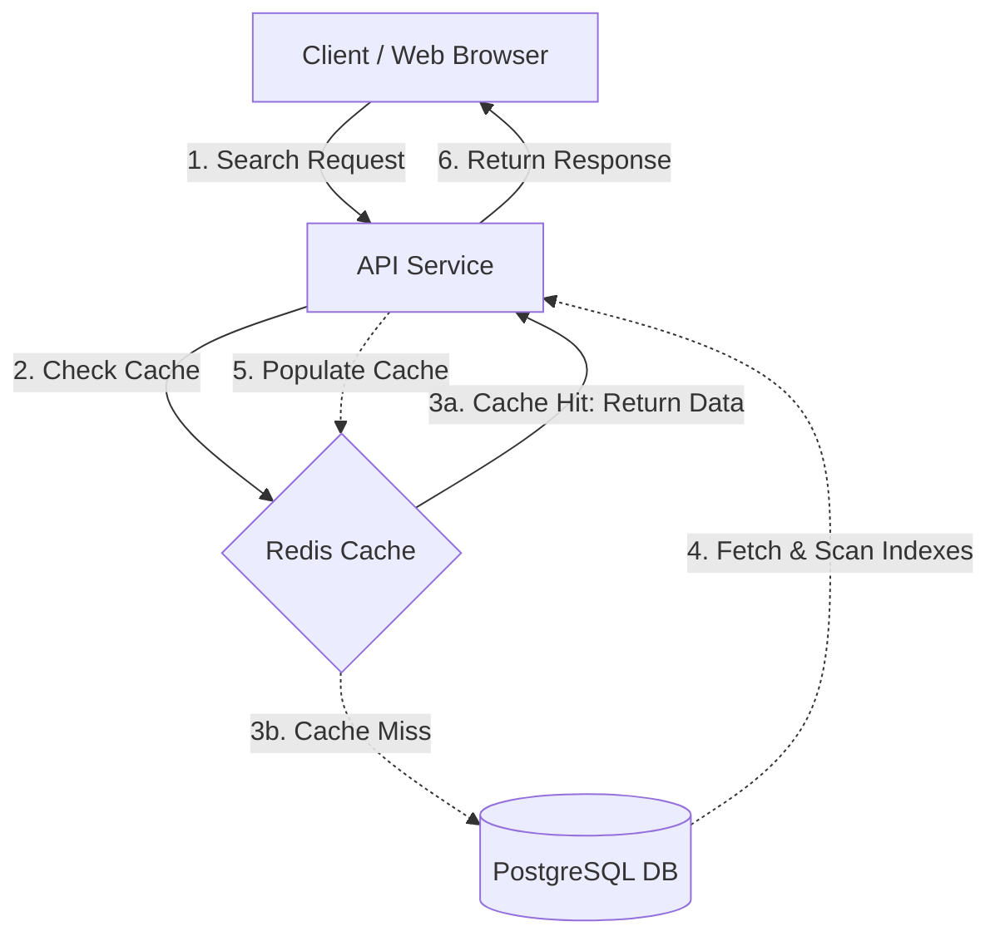
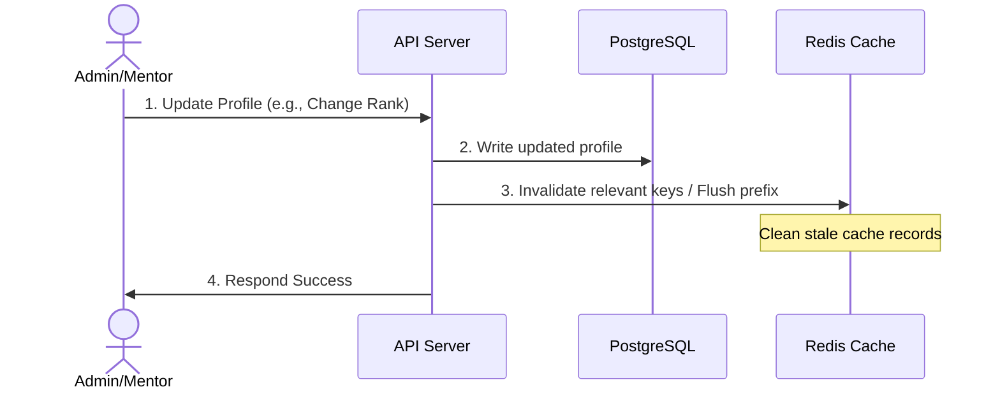

# High-Performance Mentor Search: Caching & Database Indexing Blueprint

🤖 **Applying knowledge of `@[backend-specialist]` and `@[database-architect]`...**

Under high concurrent traffic, the mentor search directory suffers from latency spikes because every filtered lookup (by `branch`, `rank`, and `specialization`) triggers complex database queries, table/index scans, and CPU-intensive database execution. 

This blueprint outlines a production-grade system design solution featuring a **Redis-based Caching Strategy**, an **LRU Eviction Policy**, an **Event-Driven Cache Update Pattern**, and a **PostgreSQL Secondary Indexing Plan** to reduce database read pressure and lower API latencies to sub-10ms.

---

## 1. System Architecture Overview

To decouple search traffic from the primary database, we insert an in-memory database (Redis) between the application service and PostgreSQL.



---

## 2. Caching Strategy: Cache-Aside (Lazy Loading)

We recommend the **Cache-Aside** pattern using **Redis** (clustered for high availability) due to its support for rich data structures, sub-millisecond latencies, and scalability.

### Rationale
- **Resilience**: If the cache cluster goes down, the application degrades gracefully by querying the primary database directly.
- **Resource Efficiency**: Only frequently searched filter combinations are stored in memory, avoiding wasting RAM on inactive profiles or unused filter permutations.

### Cache Key Design
Since mentor search queries rely on combinations of `branch`, `rank`, and `specialization` (along with pagination constraints), we serialize the query parameters into a deterministic, hashed cache key.

Format:
```text
mentor_search:branch:<branch>:rank:<rank>:spec:<specialization>:page:<page_number>
```
*Note: Any empty/wildcard filter is replaced with a standard placeholder (e.g., `any`) to ensure deterministic key mapping.*

### Logic Flow (Pseudo-code)

```typescript
import { Redis } from 'ioredis';
import { db } from './db';

const redis = new Redis(process.env.REDIS_URL);
const CACHE_TTL_SECONDS = 3600; // 1 Hour default safety fallback

interface SearchFilters {
  branch?: string;
  rank?: string;
  specialization?: string;
  page?: number;
}

export async function searchMentors(filters: SearchFilters) {
  const branch = filters.branch || 'any';
  const rank = filters.rank || 'any';
  const spec = filters.specialization || 'any';
  const page = filters.page || 1;
  
  const cacheKey = `mentor_search:branch:${branch}:rank:${rank}:spec:${spec}:page:${page}`;

  // 1. Attempt to fetch from Redis
  try {
    const cachedData = await redis.get(cacheKey);
    if (cachedData) {
      return JSON.parse(cachedData); // Cache Hit
    }
  } catch (error) {
    console.error("Redis read error, falling back to DB:", error);
  }

  // 2. Cache Miss: Query PostgreSQL database
  const searchResults = await db.profiles.findMany({
    where: {
      isApprovedMentor: true,
      ...(filters.branch && { branch: filters.branch }),
      ...(filters.rank && { rank: filters.rank }),
      ...(filters.specialization && { specialization: filters.specialization }),
    },
    skip: (page - 1) * 20,
    take: 20,
  });

  // 3. Write results back to Redis with a TTL (Time-To-Live)
  try {
    await redis.set(cacheKey, JSON.stringify(searchResults), 'EX', CACHE_TTL_SECONDS);
  } catch (error) {
    console.error("Redis write error:", error);
  }

  return searchResults;
}
```

---

## 3. Eviction Policy: Least Recently Used (LRU)

As traffic grows, the number of distinct query filter permutations stored in Redis increases. Under memory pressure, we must evict keys to prevent Out-Of-Memory (OOM) crashes.

### Policy Recommendation
We configure Redis with the **`volatile-lru`** or **`allkeys-lru`** eviction policy.
- **`allkeys-lru`**: Evicts the least recently used keys out of all keys in the database.
- **Why LRU?**: Search requests follow a Power Law distribution (Zipfian). Popular ranks, branches, and specializations are queried repeatedly, while rare filter queries are queried once and rarely accessed again. LRU automatically keeps the hot data in memory and discards the tail queries.

### Redis Configuration (`redis.conf`)
```ini
# Limit maximum RAM allocated to Redis (e.g., 2 Gigabytes)
maxmemory 2gb

# Evict the least recently used key among all keys when maxmemory is reached
maxmemory-policy allkeys-lru
```

---

## 4. Cache Update & Invalidation Pattern

To prevent users from seeing stale search results when mentor profile details (such as rank or specialization) change or when new mentors are approved, we deploy a hybrid cache invalidation strategy.



### Invalidation Triggers

1. **Active Invalidation (Event-Driven/Write-Through Cache Clear)**:
   Whenever a mentor profile is updated (via API endpoints like `PATCH /profiles/:id`) or an administrator approves a mentor:
   - Identify the affected fields.
   - Clear or invalidate search keys that match the profile's characteristics, or simply purge the entire search prefix (`mentor_search:*`) if database writes are infrequent.
   - For high-granularity updates, scan and delete keys matching specific patterns:
     ```typescript
     // Delete keys affected by a branch update
     const stream = redis.scanStream({ match: `mentor_search:branch:${oldBranch}:*` });
     stream.on('data', (keys) => {
       if (keys.length) redis.del(...keys);
     });
     ```
   
2. **Passive Invalidation (Time-To-Live - TTL)**:
   Every cache write is initialized with a TTL (e.g., `CACHE_TTL_SECONDS = 3600` / 1 hour). This acts as a safety barrier ensuring that even if an active invalidation fails (network partition, uncaught server crash), the data naturally refreshes within an hour.

---

## 5. Secondary Indexing Plan (PostgreSQL)

Even with caching, cache misses occur. To ensure database lookups are fast during a cache miss or when writing cache keys, we must optimize the layout of secondary indexes on the `profiles` table.

### Primary Query Pattern Analysis
The mentor search directory queries look similar to:
```sql
SELECT * FROM profiles 
WHERE is_approved_mentor = TRUE 
  AND branch = 'Executive'
  AND rank = 'Commander'
  AND specialization = 'Navigation'
ORDER BY updated_at DESC
LIMIT 20 OFFSET 0;
```

### Index Recommendations

#### Index 1: Composite Index for Filters (Highly Recommended)
We create a composite B-Tree index covering the exact filtering criteria. PostgreSQL indexes columns from left to right. We should place the column with the highest selectivity (or columns most frequently queried in combination) together.

```sql
CREATE INDEX CONCURRENTLY idx_profiles_mentor_filters 
ON profiles (is_approved_mentor, branch, rank, specialization);
```

*Note: We include `is_approved_mentor` first since it acts as a boolean filter partitioning approved mentors from standard users/mentees.*

#### Index 2: Partial Index for Active Mentors (Alternative Strategy)
If the table contains millions of user records, but only a small fraction (e.g., 5-10%) are approved mentors, we can create a **Partial Index**. This drastically reduces index size and storage overhead:

```sql
CREATE INDEX CONCURRENTLY idx_approved_mentors_search
ON profiles (branch, rank, specialization)
WHERE is_approved_mentor = TRUE;
```

### Execution Strategy: Zero-Downtime Migration
Creating indexes on production tables blocks database writes. We use the **`CONCURRENTLY`** keyword to create the index in the background without locking the table.

```sql
-- Ensure database migration is executed safely
-- Note: CONCURRENTLY cannot be executed inside a multi-statement transaction
CREATE INDEX CONCURRENTLY IF NOT EXISTS idx_approved_mentors_search
ON profiles (branch, rank, specialization)
WHERE is_approved_mentor = TRUE;
```

### Maintenance and Index Overhead Analysis
- **Write Overhead**: Each secondary index adds a slight write latency on `INSERT`, `UPDATE`, and `DELETE` operations since the index B-tree must be updated. Because mentor profiles are read-intensive and write-infrequent (profile data changes rarely), this is a highly acceptable trade-off.
- **Storage**: Partial indexes (`WHERE is_approved_mentor = TRUE`) are significantly smaller than full indexes, protecting database memory (buffer pool) footprint.

---

## Summary of System Benefits

| Parameter | Before Plan | After Plan |
| :--- | :--- | :--- |
| **Search Directory Latency** | 300ms - 2s (heavy database scans) | **<10ms (Redis Cache Hit)** / ~15ms (Cache Miss with Indexes) |
| **DB CPU Load** | High spike under concurrent traffic | **Near zero for read traffic** |
| **Out of Memory Risk** | High | **Low (LRU Eviction protects memory limits)** |
| **Data Consistency** | Strong | **Eventual consistency (instant invalidate on write + TTL)** |
