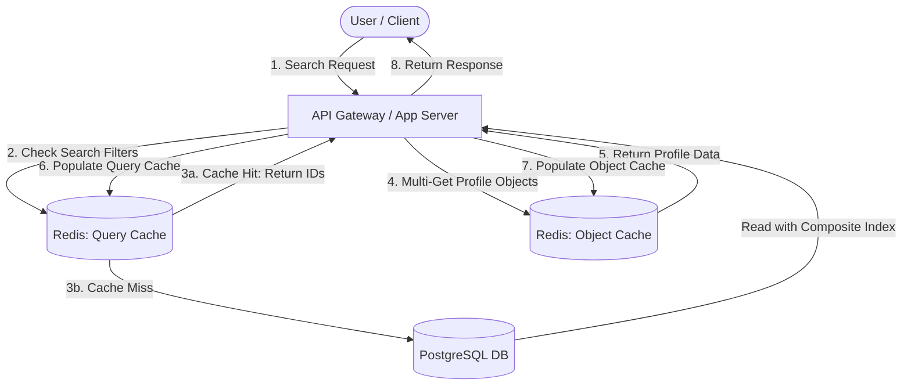

# System Design: Optimizing Mentor Search Directory Performance

This document outlines a production-grade caching strategy, eviction policy, cache update pattern, and database indexing plan to address slow response times and heavy database load on the mentor search directory under high traffic.

---

## 1. Architecture Overview

To handle heavy database lookups on search filters (`branch`, `rank`, `specialization`), we introduce a decoupled caching architecture using an in-memory database (**Redis**) alongside our primary relational database (e.g., **PostgreSQL**).



---

## 2. Caching Strategy: Two-Tier Cache Model

Instead of caching entire serialized query result arrays (which leads to high memory redundancy when search queries overlap), we implement a **Two-Tier Caching Strategy**:

### Tier 1: Search Query Cache (ID Lists)
* **Purpose**: Maps a specific combination of search filters to an array of matching Mentor IDs.
* **Key Structure**: `mentor:search:<hash_of_filters>`
  * *Generation*: To generate `<hash_of_filters>`, serialize query parameters deterministically by sorting key-value pairs and hashing them (e.g., using SHA-256).
  * *Example*: `branch=Executive&rank=Lieutenant&specialization=Navigation` sorts and hashes to `a1b2c3d4...`
  * *Key*: `mentor:search:a1b2c3d4`
* **Value**: A JSON array of integers/IDs: `[104, 309, 872]` or a Redis List/Set.

### Tier 2: Mentor Object Cache (Entity Cache)
* **Purpose**: Maps individual Mentor IDs to their complete, serialized profile objects (JSON).
* **Key Structure**: `mentor:object:<mentor_id>`
  * *Example*: `mentor:object:104`
* **Value**: `{"id": 104, "name": "Cdr. A. Bello", "rank": "Commander", "branch": "Executive", ...}`

### Why this strategy?
1. **Memory Efficiency**: If Mentor A matches 50 different filter combinations, their full profile is stored exactly **once** in Tier 2. Tier 1 only stores 4-byte or 8-byte IDs.
2. **Consistency**: If Mentor A updates their profile, we only need to invalidate/update a single key (`mentor:object:104`) instead of finding and updating every search query cache containing Mentor A.

---

## 3. Eviction Policy and TTL Strategy

To prevent memory exhaustion on Redis and clean up stale data:

### Eviction Policy
* Configure Redis with `allkeys-lru` (Least Recently Used) eviction. 
* Under high memory pressure, Redis will automatically evict the least recently accessed search queries or mentor objects.

### Time-To-Live (TTL) Strategy
We assign different TTLs to the two tiers based on their volatility:

| Cache Tier | Key Pattern | TTL Duration | Rationale |
| :--- | :--- | :--- | :--- |
| **Tier 1: Query Cache** | `mentor:search:*` | **10 - 15 Minutes** | Search query results change frequently as mentors register or update. A short TTL ensures search results remain fresh without complex real-time index synchronization. |
| **Tier 2: Object Cache** | `mentor:object:*` | **24 Hours** | Individual profile data changes rarely. A longer TTL maximizes hits, relying on active invalidation during updates to maintain consistency. |

---

## 4. Cache Update Pattern: Cache-Aside with Event-Driven Invalidation

We implement the **Cache-Aside (Lazy Loading)** pattern for reads, combined with **Active Invalidation** for updates.

### Read Path Sequence (Lazy Loading)
1. **Receive Search Request**: The API receives query parameters: `branch`, `rank`, `specialization`.
2. **Compute Cache Key**: Sort and hash the parameters to get the Query Cache Key (`mentor:search:<hash>`).
3. **Query Cache Lookup**:
   * **Hit**: Retrieve the list of Mentor IDs.
   * **Miss**: 
     * Execute SQL query on PostgreSQL (optimized by indexes, see Section 5) to retrieve matching Mentor IDs.
     * Write the retrieved IDs list to the Query Cache with a **15-minute TTL**.
4. **Fetch Mentor Profiles**:
   * Issue a Redis `MGET` (Multi-Get) for all matching object keys (`mentor:object:<id>`).
   * For any IDs missing from the Object Cache (Cache Miss):
     * Fetch those specific profiles from the DB.
     * Write them to the Object Cache with a **24-hour TTL**.
5. **Construct & Return**: Combine hit and resolved miss objects and return to client.

### Write Path Sequence (Active Invalidation)
When a mentor updates their profile:
1. **Database Update**: Save changes to the PostgreSQL database (Single source of truth).
2. **Object Invalidation**: Delete the object cache entry: `DEL mentor:object:<mentor_id>`.
3. **Query Cache Handling Options**:
   * **Option A (Simple/Eventually Consistent)**: Do nothing. Let the 10-15 minute TTL expire the Query Cache naturally. Best for systems where real-time search update is not critical.
   * **Option B (Strictly Consistent)**: Maintain a reverse lookup using a Redis Set `mentor:queries_containing:<mentor_id>` containing the Query Cache keys this mentor belongs to. When the mentor is updated, iterate and delete those query keys, then delete the set.

---

## 5. Secondary Indexing Plan (PostgreSQL)

To optimize database lookups when a cache miss occurs, we must design efficient secondary indexes in PostgreSQL.

### Database Schema Context
Assume a `mentors` table with columns: `id`, `name`, `branch`, `rank`, `specialization`, `status`, `created_at`.

### Indexing Recommendations

#### 1. Composite B-Tree Index for Combined Filtering
Since search requests filter on combinations of `branch`, `rank`, and `specialization`, we create a composite index. The order of columns in a composite index is critical:
* **Rule**: Place columns filtered with equality (`=`) first. Put the most selective columns first to narrow down rows early.
* **Query Patterns**:
  * Filter by `branch` (highly common)
  * Filter by `branch` + `rank`
  * Filter by `branch` + `rank` + `specialization`

```sql
CREATE INDEX idx_mentors_branch_rank_specialization 
ON mentors (branch, rank, specialization);
```
* **Performance Benefit**: PostgreSQL can use this index for queries filtering by `branch`, queries filtering by `branch` AND `rank`, and queries filtering by all three. (Note: It will not be efficient for queries filtering only by `specialization` without `branch`).

#### 2. Partial Indexing for Active Mentors
Typically, directory searches only return active/approved mentors. We should add a filter to exclude inactive mentors from the index, drastically reducing index size and search overhead:

```sql
CREATE INDEX idx_active_mentors_search 
ON mentors (branch, rank, specialization) 
WHERE status = 'Active';
```
* **Performance Benefit**: Reduces disk I/O and keeps the index entirely in RAM, improving cache-miss query execution times.

#### 3. Covering Index (Index-Only Scans)
If the search directory only shows summary cards (e.g., name, avatar, rating) in the list view, we can include these fields directly in the index payload using the `INCLUDE` clause. This allows PostgreSQL to perform an **Index-Only Scan**, returning data without visiting the main table pages.

```sql
CREATE INDEX idx_mentors_covering_search 
ON mentors (branch, rank, specialization) 
INCLUDE (id, name, avatar_url, rating)
WHERE status = 'Active';
```

---

## Summary of Benefits

1. **DB Load Reduction**: Cache-aside prevents duplicate heavy queries under high traffic, while the two-tier structure keeps Redis memory footprint minimal.
2. **Low Latency**: `MGET` operations in Redis execute in $O(N)$ time (where $N$ is small, typical page size), yielding sub-10ms response times for cache hits.
3. **Database Efficiency**: When database reads do occur (cache misses), PostgreSQL uses covering, partial composite indexes to locate matching records in $<5\text{ms}$.
